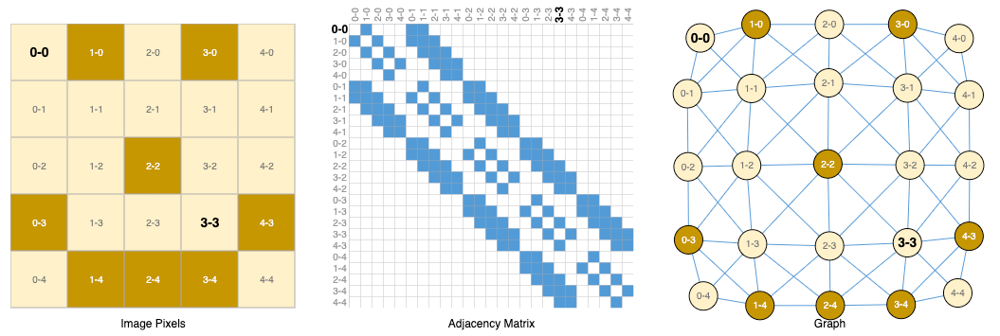
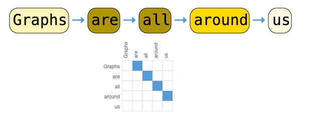
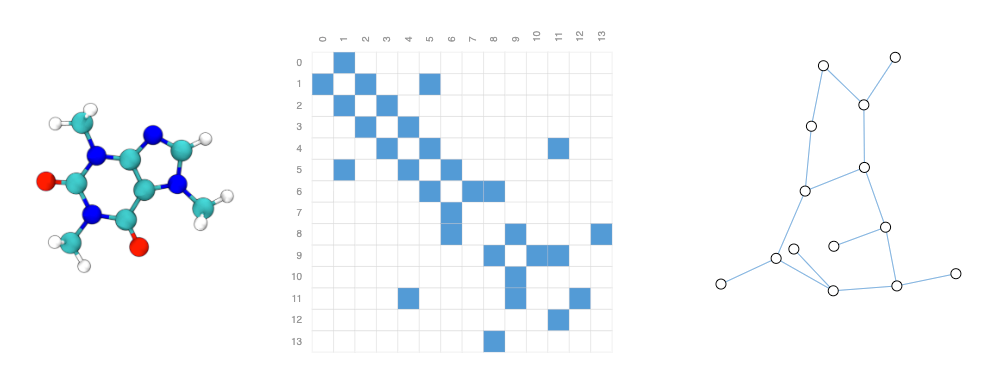
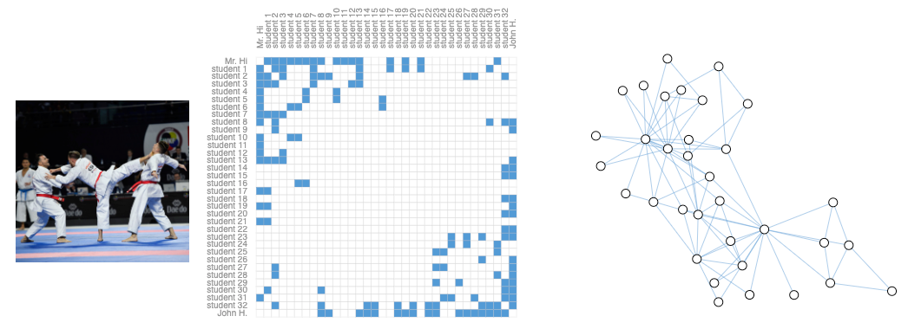

<style>
img[alt~="center"] {
  display: block;
  margin: 0 auto;
}
</style>

<!-- class: invert -->

<!-- Intro Slide -->
# Graph Machine Learning with Python  
### Pietro Mascolo
&nbsp;
<!--  -->

> A practical introduction to working with graphs in Python
> https://bit.ly/4dp0Yju

<!--
Speaker Notes:
Welcome everyone! I'm [Your Name], and today we'll explore how to leverage graph structures in machine learning using Python. We'll delve into the basics of graphs, explore Python libraries like NetworkX and PyTorch Geometric, and work through a practical example in fraud detection.
-->


## 🗂️ Agenda

1. 👋 Introduction  
2. 🌐 Graph Fundamentals  
3. 🐍 Working with Graphs in Python  
4. 🧠 Graph Neural Networks  
5. 🛠️ Practical Example: Fraud Detection with PyTorch Geometric  
6. 🧾 Summary & Q&A

<!--
Speaker Notes:
Here's our roadmap for today. We'll start with an introduction to graphs, move on to how Python handles them, dive into graph neural networks, and conclude with a hands-on example in fraud detection.
-->


## 👋 About Me


- 👤 Name: Pietro
- 👪 Husband and dad.
- 🇮🇪 Based in ireland.
- 💼 Data Scientist and AI Engineer.
- 💻 Passionate about applied AI, Python, and Go.
-  🥋📷🥾
- 📫 `@iz4vve`(X, github, ...)

<!--
Speaker Notes:
A brief about me: I'm [Your Name], with a background in machine learning and data science. My work focuses on applying AI to real-world problems, especially those involving graph structures like fraud detection and social network analysis.
-->


## 🌐 What is a Graph?

A **graph** is a mathematical structure used to model relationships.

- **Nodes (or vertices):** entities  
- **Edges:** relationships


<!--  -->

<!--
Speaker Notes:
Graphs consist of nodes representing entities and edges representing relationships. They're powerful tools for modeling complex, interconnected systems.
-->


## 🤝 Real-World Graph Examples

- 🧑‍🤝‍🧑 Social Networks: People = nodes, Friendships = edges  
- 🛒 E-commerce: Products = nodes, "bought-together" = edges  
- 💳 Fraud Detection: Accounts = nodes, Transactions = edges  
- 🔬 Biology: Proteins = nodes, Interactions = edges

Graphs model **relational data** — something traditional ML doesn't capture well.


<!--
Speaker Notes:
Graphs are ubiquitous. From social networks to biological systems, they help us understand and analyze relationships in data that traditional machine learning might overlook.
-->


## 📈 Graph Example


_A simple undirected graph showing a small group of individuals and their connections._

<!--
Speaker Notes:
Here's a simple graph illustrating connections between individuals. Such visualizations help in understanding the structure and relationships within data.
-->

## 🌍 Graphs are everywhere



## 🌍 Graphs are everywhere



## 🌍 Graphs are everywhere



## 🌍 Graphs are everywhere




## 🤔 Why Use Graphs in Machine Learning?

Traditional ML struggles with **non-Euclidean** data.  
Graphs let us:

- Understand **structure and relationships**  
- Use **message passing** to learn from context  
- Solve tasks like:
  - Node classification (e.g., fraud or not)
  - Link prediction (e.g., will these users connect?)
  - Graph classification (e.g., toxic molecule or not)


<!--
Speaker Notes:
Graphs enable machine learning models to capture relationships and structures in data, allowing for more nuanced analyses like predicting fraudulent activities or understanding social connections.
-->

## 🚩 Types of graph problems


## 🐍 Graphs with `networkx`

- A standard library for building and analyzing graphs

```python
import networkx as nx
import matplotlib.pyplot as plt

G = nx.Graph()
G.add_edges_from([
    ("Alice", "Bob"),
    ("Alice", "Carol"),
    ("Carol", "Dave"),
    ("Bob", "Dave")
])

nx.draw(
  G, with_labels=True, node_color="lightblue", edge_color="gray"
)
plt.show()
```


<!--
Speaker Notes:
NetworkX is a powerful Python library for creating and analyzing graphs. Here's how you can build a simple graph and visualize it.
-->


## 🔍 Graph Analysis with `networkx`

```python
print("Nodes:", G.nodes())
print("Edges:", G.edges())
print("Degree of Carol:", G.degree("Carol"))

# Find shortest path
path = nx.shortest_path(G, source="Alice", target="Dave")
print("Shortest path from Alice to Dave:", path)
```

```bash
Nodes: ['Alice', 'Bob', 'Carol', 'Dave']
Edges: [('Alice', 'Bob'), ('Alice', 'Carol'), ('Bob', 'Dave'), ('Carol', 'Dave')]
Degree of Carol: 2
Shortest path from Alice to Dave: ['Alice', 'Carol', 'Dave']
```
<!--
Speaker Notes:
NetworkX provides various functions to analyze graphs, such as retrieving nodes and edges, calculating degrees, and finding shortest paths.
-->


## 🧠 What Are Graph Neural Networks (GNNs)?

> GNNs are neural networks that operate on graph structures.

Each node aggregates and updates its **feature vector** from its neighbors.

Typical pipeline:
1. Initialize node features (e.g., account age, balance)
2. Perform message passing via GNN layers
3. Predict labels or scores (fraud, risk, etc.)


<!--
Speaker Notes:
Graph Neural Networks extend traditional neural networks to graph data, allowing nodes to learn from their neighbors' features through message passing.
-->


## 📚 Popular GNN Architectures

- **GCN** (Graph Convolutional Network)  
- **GAT** (Graph Attention Network)  
- **GraphSAGE**  
- **GIN** (Graph Isomorphism Network)

Libraries like **PyTorch Geometric** make these easy to use.


<!--
Speaker Notes:
Several GNN architectures have been developed, each with unique approaches to aggregating and updating node information. PyTorch Geometric simplifies implementing these models.
-->


<!-- slide: title -->
# 🧠 How Do Graph Neural Networks Work?

A GNN learns a **representation for each node** based on:
- Its own features
- Its neighbors’ features

This is done through a process called:

### 🔄 Message Passing


<!-- slide: data-auto-animate -->
# 🔄 Message Passing – Step-by-Step 1/2

### 1️⃣ Each Node Starts With a Feature Vector  
Usually denoted as $( h_v^{(0)} )$

```python
# Example: Node feature matrix
x = torch.tensor([
    [1.0, 0.5],  # Node 0
    [0.3, 1.2],  # Node 1
    ...
])
```

# 🔄 Message Passing – Step-by-Step 2/2

### 2️⃣ At Each Layer:
- A node gathers messages from neighbors
- Aggregates them (e.g. sum, mean)
- Updates its own feature using a neural net


<!-- slide: data-auto-animate -->
# 🧠 GCN Layer Formula

A common GNN layer is the **Graph Convolutional Network (GCN)**:

$$
h_v^{(l+1)} = \sigma\left( \sum_{u \in \mathcal{N}(v)} W h_u^{(l)} \right)
$$

Where:

- $( h_v^{(l)} )$: Node $(v)$'s features at layer $(l)$
- $( \mathcal{N}(v) )$: Neighbors of$ (v)$
- $( W )$: Learnable weight matrix
- $( \sigma )$: Non-linearity (e.g. ReLU)

This spreads information across the graph — each node gets a bit smarter every layer.


<!-- slide: data-auto-animate -->
# 🧪 Example with Intuition

Let’s say we want to **predict if a node is a fraudster**.

At layer 0:
- Node features might include:
  - Transaction amount
  - Account age
  - Number of edges (degree)

After 2 GCN layers:
- Each node's features include signals from **its neighborhood**
- Fraudsters tend to connect with other fraudsters — GNN learns that!

🧠 Now you can classify nodes using a final MLP or softmax layer.


<!-- slide -->
# 🔁 Recap: GNNs in a Nutshell

✅ GNNs learn node embeddings  
✅ Each layer mixes neighborhood information  
✅ Useful for:
- Node classification (e.g. fraud detection)
- Link prediction (e.g. friend suggestion)
- Graph classification (e.g. molecule toxicity)


## 🔧 Install PyTorch Geometric (PyG)

```bash
pip install torch
pip install torch-geometric
```


<!--
Speaker Notes:
To get started with PyTorch Geometric, install PyTorch followed by torch-geometric using pip.
-->


## 🧪 Simple GNN with PyG

We’ll start with the **Karate Club dataset**, a classic benchmark.

```python
from torch_geometric.datasets import KarateClub
from torch_geometric.nn import GCNConv
import torch.nn.functional as F
import torch

dataset = KarateClub()
data = dataset[0]

class GCN(torch.nn.Module):
    def __init__(self):
        super().__init__()
        self.conv1 = GCNConv(data.num_features, 16)
        self.conv2 = GCNConv(16, dataset.num_classes)

    def forward(self, x, edge_index):
        x = self.conv1(x, edge_index)
        x = F.relu(x)
        x = self.conv2(x, edge_index)
        return F.log_softmax(x, dim=1)
```


<!--
Speaker Notes:
Let's implement a simple Graph Convolutional Network using the Karate Club dataset, which represents social interactions in a karate club.
-->


## 🏋️ Train the GNN

```python
model = GCN()
optimizer = torch.optim.Adam(model.parameters(), lr=0.01)
criterion = torch.nn.NLLLoss()

model.train()
for epoch in range(200):
    optimizer.zero_grad()
    out = model(data.x, data.edge_index)
    loss = criterion(out[data.train_mask], data.y[data.train_mask])
    loss.backward()
    optimizer.step()

print("Training complete.")
```

<!--
Speaker Notes:
We train the GCN model using the Adam optimizer and negative log-likelihood loss. After 200 epochs, the model should be well-trained.
-->


## 🔬 Evaluate the GNN

```python
model.eval()
pred = out.argmax(dim=1)
correct = (pred[data.test_mask] == data.y[data.test_mask]).sum()
accuracy = int(correct) / int(data.test_mask.sum())
print(f"Test Accuracy: {accuracy:.4f}")
```

<!--
Speaker Notes:
After training, we evaluate the model's performance on the test set by calculating the accuracy of its predictions.
-->


## ⚠️ Real-World Use Case: Fraud Detection

Fraud networks often form complex **graph topologies**.  
Examples:

- Fraud rings  
- Transaction laundering  
- Identity theft patterns

A GNN can learn suspicious **structural patterns** better than traditional ML.


<!--
Speaker Notes:
In fraud detection, entities like accounts and transactions can be modeled as graphs, allowing GNNs to detect complex fraudulent patterns that traditional methods might miss.
-->


## 📂 Dataset: Elliptic Bitcoin Graph

- Nodes = Bitcoin addresses  
- Edges = Transactions  
- Features = temporal and transaction features
- Label: `fraud` (1) or `legit` (0), $\approx 23\%$ of data is labeled, imbalance ratio 9:1
- [Available on Kaggle](https://www.kaggle.com/ellipticco/elliptic-data-set)


<!--
Speaker Notes:
The Elliptic dataset provides a real-world example of transaction data in the Bitcoin network, labeled for fraudulent and legitimate activities.
-->


## Conclusions

## Thanks