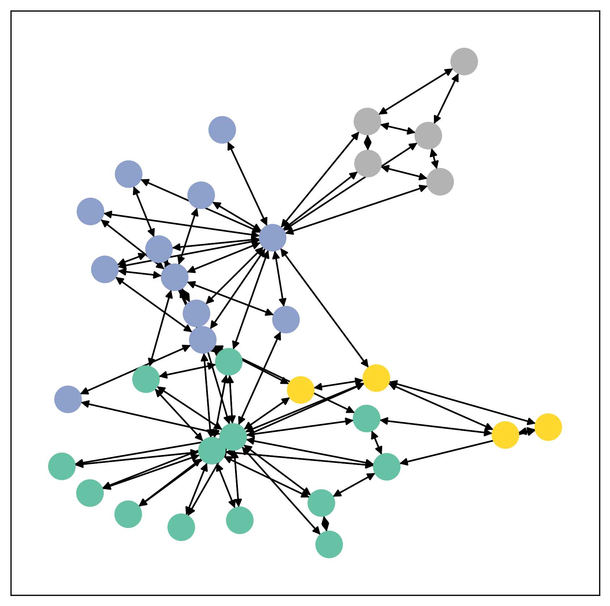

<style>
img[alt~="center"] {
  display: block;
  margin: 0 auto;
}
</style>


<!-- Intro Slide -->
<!-- _paginate: skip -->
# Graph Machine Learning with Python
##### Bologna, 2025-05-29

&nbsp;
<!--  -->


> A practical introduction to working with graphs in Python
> https://bit.ly/4dp0Yju

<!--
Speaker Notes:
Welcome everyone! I'm [Your Name], and today we'll explore how to leverage graph structures in machine learning using Python. We'll delve into the basics of graphs, explore Python libraries like NetworkX and PyTorch Geometric, and work through a practical example in fraud detection.
-->

<!-- slide: data-auto-animate -->
## 🗂️ Agenda

1. 👋 Introduction  
2. 🌐 Graph Fundamentals  
3. 🐍 Working with Graphs in Python  
4. 🧠 Graph Neural Networks  
5. 🛠️ Real world example
6. 🧾 Summary & Q&A

<!--
Speaker Notes:
Here's our roadmap for today. We'll start with an introduction to graphs, move on to how Python handles them, dive into graph neural networks, and conclude with a hands-on example in fraud detection.
-->


## 👋 About Me


- 👤 Name: Pietro
- 👪 Husband and dad.
- 🇮🇪 Based in Ireland.
- 💼 Data Scientist and AI Engineer.
- 💻 Passionate about applied AI, Python, and Go.
-  🥋  📷  📻  🥾
- 📫 `@iz4vve`(X, github, ...)

<!--
Speaker Notes:
A brief about me: I'm [Your Name], with a background in machine learning and data science. My work focuses on applying AI to real-world problems, especially those involving graph structures like fraud detection and social network analysis.
-->


# Graphs
&nbsp;
<!-- _paginate: skip -->
<!-- _footer: "" -->


## 🌐 What is a Graph?

A **graph** represents the relations (edges) between a collection of entities (nodes).

- **Nodes (or vertices):** entities  
- **Edges:** relationships, can have a specific direction.

Both can contain extra information and attributes.


<!--
Speaker Notes:
Graphs are all around us; real world objects are often defined in terms of their connections to other things. A set of objects, and the connections between them, are naturally expressed as a graph. Researchers have developed neural networks that operate on graph data (called graph neural networks, or GNNs) for over a decade
. Recent developments have increased their capabilities and expressive power. We are starting to see practical applications in areas such as antibacterial discovery , physics simulations, fake news detection, traffic prediction and recommendation systems.

This article explores and explains modern graph neural networks. We divide this work into four parts. First, we look at what kind of data is most naturally phrased as a graph, and some common examples. Second, we explore what makes graphs different from other types of data, and some of the specialized choices we have to make when using graphs. Third, we build a modern GNN, walking through each of the parts of the model, starting with historic modeling innovations in the field. We move gradually from a bare-bones implementation to a state-of-the-art GNN model. Fourth and finally, we provide a GNN playground where you can play around with a real-word task and dataset to build a stronger intuition of how each component of a GNN model contributes to the predictions it makes.
-->


## 📈 Graph Example



_A simple undirected graph showing a small group of individuals and their connections._

<!--
Speaker Notes:
Here's a simple graph illustrating connections between individuals. Such visualizations help in understanding the structure and relationships within data.
-->


## 🤝 Real-World Graph Examples

- 🧑‍🤝‍🧑 Social Networks: People = nodes, Friendships = edges  
- 🛒 E-commerce: Products = nodes, "bought-together" = edges  
- 💳 Fraud Detection: Accounts = nodes, Transactions = edges  
- 🔬 Biology: Proteins = nodes, Interactions = edges

Graphs model **relational data** — something traditional ML doesn't capture well.


<!--
Speaker Notes:
Graphs are ubiquitous. From social networks to biological systems, they help us understand and analyze relationships in data that traditional machine learning might overlook.
-->


## 🌍 Graphs are everywhere


## 🌍 Graphs are everywhere


## 🌍 Graphs are everywhere


## 🌍 Graphs are everywhere


# Graph Machine Learning
<!-- _paginate: skip -->
<!-- _footer: "" -->


## 🤔 Why Use Graphs in Machine Learning?

Traditional ML struggles with **non-Euclidean** data.  
Graphs let us:

- Understand **structure and relationships**  
- Use **message passing** to learn from context  
- Solve tasks like:
  - Node classification (e.g., fraud or not)
  - Link prediction (e.g., will these users connect?)
  - Graph classification (e.g., toxic molecule or not)
  - Analysis of complex relationships


<!--
Speaker Notes:
Graphs enable machine learning models to capture relationships and structures in data, allowing for more nuanced analyses like predicting fraudulent activities or understanding social connections.
-->

<!-- slide: data-auto-animate -->
## 🚩 Types of problems


 - Node classification
 - Graph classification
 - Link prediction
 - Graph regression
 - Node regression
 - Edge regression
 - Edge classification
 - Spatio-temporal Prediction
 - Graph Generation
 - ...

<!-- 
1. Node Classification
Task: Predict a label for each node based on features and graph structure.
Examples:

Predicting whether a user is a bot or human in a social network.

Classifying academic papers by topic in a citation network.

Identifying disease-associated proteins in a biological interaction graph.
GNNs: GCN, GraphSAGE, GAT

2. Graph Classification
Task: Predict a label for an entire graph.
Examples:

Classifying molecules as toxic or non-toxic.

Detecting fraudulent vs. legitimate financial transaction graphs.

Diagnosing diseases based on brain connectivity graphs.
GNNs: GIN, DiffPool, DGCNN

3. Link Prediction
Task: Predict whether an edge exists between two nodes.
Examples:

Recommending friends in social networks (e.g., Facebook).

Inferring missing connections in knowledge graphs.

Predicting interactions between drugs and proteins.
GNNs: Graph Autoencoder (GAE), GraphSAGE, SEAL

4. Graph Regression
Task: Predict a continuous value for a graph.
Examples:

Estimating the binding affinity of molecules to a target.

Predicting the melting point of chemical compounds.

Computing energy of physical systems in quantum chemistry.
GNNs: MPNN, GIN, EGNN

5. Node Regression
Task: Predict continuous values at the node level.
Examples:

Forecasting temperature at each weather station in a sensor network.

Predicting real estate values in a city-wide spatial graph.

Estimating node centrality or influence in a social network.
GNNs: GCN, GraphSAGE, ChebNet

6. Edge Classification
Task: Classify the type or label of an edge between nodes.
Examples:

Classifying relationships (e.g., "employed by", "located in") in a knowledge graph.

Identifying transaction types in a financial network.

Detecting communication types (text, voice, video) between users.
GNNs: R-GCN, GAT, MPNN

7. Spatio-temporal Prediction
Task: Forecast values that vary over time on a graph.
Examples:

Predicting future traffic speed on roads.

Forecasting electricity demand across a power grid.

Anticipating crowd movement in public spaces.
GNNs: ST-GCN, T-GCN, DCRNN

8. Edge Regression
Task: Predict a continuous value associated with an edge.
Examples:

Estimating travel time between two locations in a road network.

Predicting latency in a computer or telecom network.

Estimating trust scores in peer-to-peer systems.
GNNs: MPNN, EGNN, SE(3)-Transformer

9. Graph Generation
Task: Generate new graphs that mimic properties of training graphs.
Examples:

Designing new molecules for drug discovery.

Creating synthetic social graphs for simulation/testing.

Generating neural architectures in NAS (Neural Architecture Search).
GNNs: GraphRNN, GraphVAE, GraphAF

10. Heterogeneous Graph Learning
Task: Learn from graphs with multiple types of nodes/edges.
Examples:

Recommending content to users in a user–item–tag graph.

Predicting paper impact in an academic graph with authors, papers, and venues.

Detecting fraud in transaction graphs with users, devices, and merchants.
GNNs: HAN, R-GCN, HGT
-->


## 🐍 Graphs with `networkx`

```python
import networkx as nx

G = nx.Graph()
G.add_edges_from([
    ("Alice", "Bob"), ("Alice", "Carol"), ("Carol", "Dave"), ("Bob", "Dave")
])

nx.draw(G, with_labels=True, node_color="lightblue", edge_color="gray")
```


<!--
Speaker Notes:
NetworkX is a powerful Python library for creating and analyzing graphs. Here's how you can build a simple graph and visualize it.
-->


## 🔍 Graph Analysis with `networkx`

```bash
>>> print("Nodes:", G.nodes())
Nodes: ['Alice', 'Bob', 'Carol', 'Dave']

>>> print("Edges:", G.edges())
Edges: [('Alice', 'Bob'), ('Alice', 'Carol'), ('Bob', 'Dave'), ('Carol', 'Dave')]

>>> print("Degree of Carol:", G.degree("Carol"))
Degree of Carol: 2

# Find shortest path
>>> path = nx.shortest_path(G, source="Alice", target="Dave")
>>> print("Shortest path from Alice to Dave:", path)
Shortest path from Alice to Dave: ['Alice', 'Carol', 'Dave']
```
<!--
Speaker Notes:
NetworkX provides various functions to analyze graphs, such as retrieving nodes and edges, calculating degrees, and finding shortest paths.
-->

## 🎨 Graph representation

<!--
So, how do we go about solving these different graph tasks with neural networks? The first step is to think about how we will represent graphs to be compatible with neural networks.

Machine learning models typically take rectangular or grid-like arrays as input. So, it’s not intuitive how to represent them in a format that is compatible with deep learning. Graphs have up to four types of information: nodes, edges, global-context and connectivity. The first three are relatively straightforward: for example, with nodes we can form a node feature matrix 𝑁
 by assigning each node an index 𝑖 and storing the feature for 𝑛𝑜𝑑𝑒𝑖 in 𝑁

However, representing a graph’s connectivity is more complicated. Perhaps the most obvious choice would be to use an adjacency matrix, since this is easily tensorisable. A few drawbacks. From the example dataset table, we see the number of nodes in a graph can be on the order of millions, and the number of edges per node can be highly variable. Often, this leads to very sparse adjacency matrices, which are space-inefficient.

Another problem is that there are many adjacency matrices that can encode the same connectivity, and there is no guarantee that these different matrices would produce the same result in a deep neural network (that is to say, they are not permutation invariant).

Learning permutation invariant operations is an area of recent research.
For example, the Othello graph from before can be described equivalently with these two adjacency matrices. It can also be described with every other possible permutation of the nodes.
-->


## 🎨 Graph representation (permutation invariant)
<!-- _footer: "" -->

```python
# adjacency list
adj_list = """
  A B C
  B C D
  C D
  D A
"""

node_properties = {
  "A": { ... },
  "B": { ... },
  ...
}

edge_properties = {
  ('A', 'B'): { ... },
  ('A', 'C'): { ... },
  ...
}
```


## 🧠 What Are Graph Neural Networks (GNNs)?

> GNNs are neural networks that operate on graph structures.

Each node aggregates and updates its **feature vector** from its neighbors.

Typical pipeline:
1. Initialize node features (e.g., account age, balance)
2. Perform message passing via GNN layers
3. Predict labels or scores (fraud, risk, etc.)


<!--
Speaker Notes:
Graph Neural Networks extend traditional neural networks to graph data, allowing nodes to learn from their neighbors' features through message passing.
-->


## 📚 Popular GNN Architectures


- **GCN** (Graph Convolutional Network)  
- **GAT** (Graph Attention Network)  
- **GraphSAGE**  
- **GIN** (Graph Isomorphism Network)
- ...

Libraries like **PyTorch Geometric** make these easy to use.


<!--
Speaker Notes:
Several GNN architectures have been developed, each with unique approaches to aggregating and updating node information. PyTorch Geometric simplifies implementing these models.
-->


# 🧠 How Do Graph Neural Networks Work?

A GNN learns a **representation for each node** based on:
- Its own features
- Its neighbors’ features

This is done through a process called **Message Passing**


<!-- # 🔄 Message Passing – Step-by-Step 1/2

### 1️⃣ Each Node Starts With a Feature Vector  
Usually denoted as $( h_v^{(0)} )$

```python
# Example: Node feature matrix
x = torch.tensor([
    [1.0, 0.5],  # Node 0
    [0.3, 1.2],  # Node 1
    ...
])
``` 
-->

# 🔄 Message Passing – Step-by-Step

### 2️⃣ At Each Layer:
- A node gathers messages from neighbors
- Aggregates them (e.g. sum, mean)
- Updates its own feature using a neural net


# 🧠 GCN Layer

$$
h_v^{(l+1)} = \sigma\left( \sum_{u \in \mathcal{N}(v)} W h_u^{(l)} \right)
$$

Where:

- $( h_v^{(l)} )$: Node $(v)$'s features at layer $(l)$
- $( \mathcal{N}(v) )$: Neighbors of $(v)$
- $( W )$: Learnable weight matrix
- $( \sigma )$: Non-linearity (e.g. ReLU)


<!-- slide: data-auto-animate -->
<!-- # 🧪 Example with Intuition

Let’s say we want to **predict if a node is a fraudster**.

At layer 0:
- Node features might include:
  - Transaction amount
  - Account age
  - Number of edges (degree)

After 2 GCN layers:
- Each node's features include signals from **its neighborhood**
- Fraudsters tend to connect with other fraudsters — GNN learns that!

🧠 Now you can classify nodes using a final MLP or softmax layer. -->


# 🔁 Recap: GNNs in a Nutshell

✅ GNNs learn node embeddings  
✅ Each layer mixes neighborhood information  
✅ Useful for:
- Node classification (e.g. fraud detection)
- Link prediction (e.g. friend suggestion)
- Graph classification (e.g. molecule toxicity)


# Implementing a GNN
<!-- _paginate: skip -->
<!-- _footer: "" -->


<!-- ## 🔧 Install PyTorch Geometric (PyG)

```bash
pip install torch
pip install torch-geometric
```

 -->

<!--
Speaker Notes:
To get started with PyTorch Geometric, install PyTorch followed by torch-geometric using pip.
-->


## 🧪 Simple GNN with PyG

```python
from torch_geometric.nn import GCNConv
import torch.nn.functional as F
import torch


class GCN(torch.nn.Module):
    def __init__(self, num_features=100, num_classes=2, hidden_dim=16):
        super().__init__()
        self.conv1 = GCNConv(num_features, hidden_dim)
        self.conv2 = GCNConv(hidden_dim, num_classes)

    def forward(self, x, edge_index):
        x = self.conv1(x, edge_index)
        x = F.relu(x)
        x = self.conv2(x, edge_index)
        return F.log_softmax(x, dim=1)
```

<!--
Speaker Notes:
Let's implement a simple Graph Convolutional Network using the Karate Club dataset, which represents social interactions in a karate club.
-->


## 🏋️ Train the GNN

```python
model = GCN()
optimizer = torch.optim.Adam(model.parameters(), lr=0.01)
criterion = torch.nn.NLLLoss()

model.train()
for epoch in range(200):
    optimizer.zero_grad()
    out = model(data.x, data.edge_index)
    loss = criterion(out[data.train_mask], data.y[data.train_mask])
    loss.backward()
    optimizer.step()

print("Training complete.")
```

<!--
Speaker Notes:
We train the GCN model using the Adam optimizer and negative log-likelihood loss. After 200 epochs, the model should be well-trained.
-->


## 🔬 Evaluate the GNN

```python
model.eval()
pred = out.argmax(dim=1)
correct = (pred[data.test_mask] == data.y[data.test_mask]).sum()
accuracy = int(correct) / int(data.test_mask.sum())
print(f"Test Accuracy: {accuracy:.4f}")
```

<!--
Speaker Notes:
After training, we evaluate the model's performance on the test set by calculating the accuracy of its predictions.
-->


## ⚠️ Real-World Use Case: Paper classification

Paper citations often form complex **graph topologies**.  

A GNN can learn **structural patterns** better than traditional ML, which can be leveraged to infer a paper's category from the paper it cites and the papers that cite it.


<!--
Speaker Notes:
In fraud detection, entities like accounts and transactions can be modeled as graphs, allowing GNNs to detect complex fraudulent patterns that traditional methods might miss.
-->

## 📚 Cora Dataset Overview

A benchmark citation network used for node classification and graph learning tasks.

<div style="padding-left: 40px">

>>> | **Property**        | **Value**                    |
>>> |---------------------|------------------------------|
>>> | Dataset Name        | Cora                         |
>>> | Task                | Node Classification          |
>>> | Number of Nodes     | 2,708                        |
>>> | Number of Edges     | 5,429 (undirected)           |
>>> | Number of Classes   | 70                           |
>>> | Node Features       | 1,433 (bag-of-words)         |
>>> | Edge Type           | Paper cites paper            |

</div>

## 💡 Label Distribution & Use

- Each node = 1 paper
- Classes = 7 topics (e.g., Reinforcement Learning, Probabilistic Methods)
- Used in benchmarks for: GCN, GAT, GraphSAGE, etc.


<!-- ## ⚠️ Real-World Use Case: Fraud detection

Fraud networks often form complex **graph topologies**.  
Examples:

- Fraud rings  
- Transaction laundering  
- Identity theft patterns

A GNN can learn suspicious **structural patterns** better than traditional ML.


## 📂 Dataset: Elliptic Bitcoin Graph

- Nodes = Bitcoin addresses  
- Edges = Transactions  
- Features = temporal and transaction features
- Label: `fraud` (1) or `legit` (0), $\approx 23\%$ of data is labeled, imbalance ratio 9:1
- [Available on Kaggle](https://www.kaggle.com/ellipticco/elliptic-data-set)
 -->

<!--ß
Speaker Notes:
The Elliptic dataset provides a real-world example of transaction data in the Bitcoin network, labeled for fraudulent and legitimate activities.
-->

## Results

>>> |                 | **GBC**     | **GNN**    |
>>> |-----------------|-------------|------------|
>>> | Training time   | 218 min     | 27.8 s     |
>>> | Accuracy        | 0.543       | 0.722      |
>>> | Precision       | 0.554       | 0.723      |
>>> | Recall          | 0.543       | 0.722      |
>>> | F1              | 0.542       | 0.718      |
>>> | ROC (OvR)       | 0.904       | 0.985      |
ß
## Conclusions

<!--
Speaker Notes:
Disadvantages of Graph Neural Networks
There are a few drawbacks to using GNNs

 - Most neural networks can go deep to obtain better performance, GNNs are shallow networks mostly with three layers. It limits us from achieving state-of-the-art performance on large datasets.
 - The graph structures are constantly changing, making it harder to train a model on it. 
 - Deploying the model to production faces scalability issues as these networks are computationally expensive. If you have a large and complex graph structure, it will be hard for you to scale the GNNs in production. 
-->

## Questions?
&nbsp;
&nbsp;
### You can ask... I might even answer...
<!-- _color: #444444-->
<!-- _paginate: skip -->
<!-- _footer: "" -->


# Thanks for your attention
&nbsp;
<!-- _paginate: skip -->
<!-- _footer: "" -->

